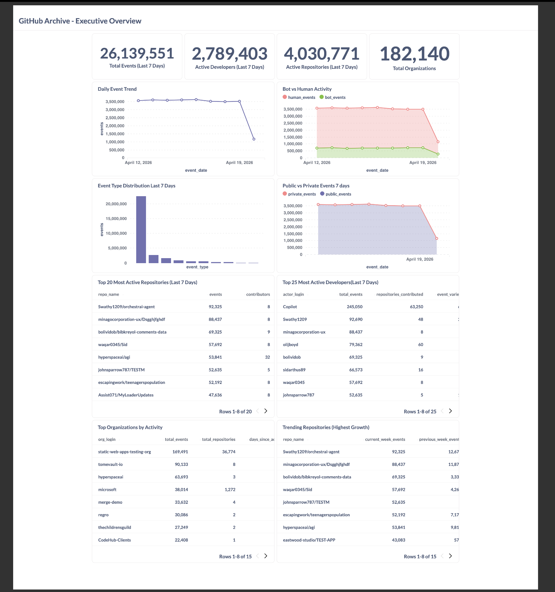
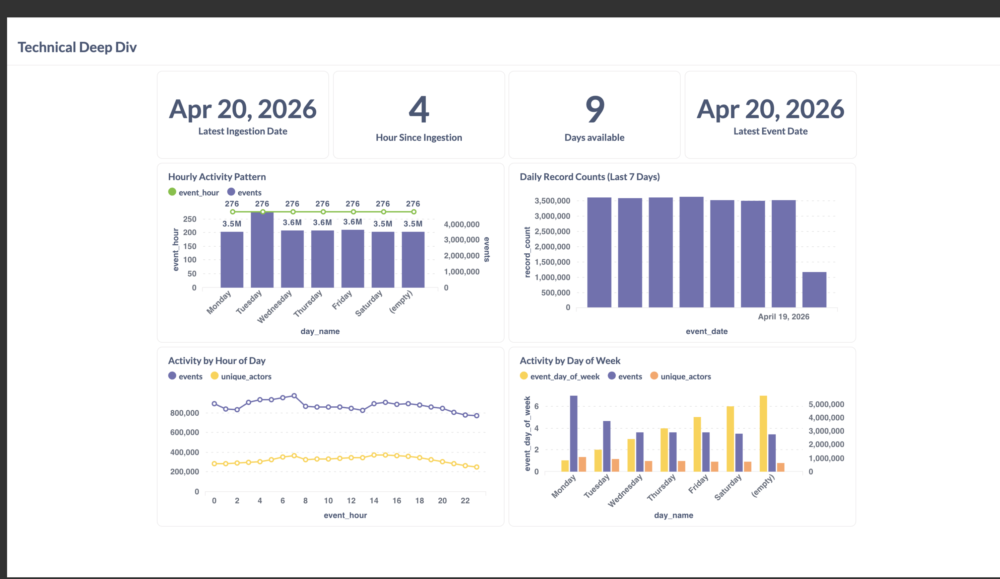

# GitHub Archive Analytics Pipeline

[](LICENSE)
[](https://www.python.org/)
[](https://www.getdbt.com/)
[](https://airflow.apache.org/)

---

## 📋 Table of Contents
- [Problem Description](#-problem-description)
- [Dataset](#-dataset)
- [Technologies](#-technologies)
- [Architecture](#-architecture)
- [Data Pipeline](#-data-pipeline)
- [Data Warehouse](#-data-warehouse)
- [Transformations](#-transformations)
- [Dashboard](#-dashboard)
- [Reproducibility](#-reproducibility)
- [Future Enhancements](#-future-enhancements)

---

## 🎯 Problem Description

### Business Problem
Open-source software development has become the backbone of modern technology, but understanding trends, patterns, and community health across millions of repositories remains challenging. Organizations, developers, and researchers need insights into:

- **Developer Activity**: Who are the most active contributors? What are the engagement patterns?
- **Repository Trends**: Which projects are gaining traction? What technologies are trending?
- **Community Health**: What's the ratio of bots vs humans? What are peak contribution times?
- **Event Patterns**: How do different event types (commits, PRs, issues) correlate?

### Solution
This project builds an **end-to-end data pipeline** that:

1. **Ingests** hourly snapshots of all public GitHub events (300K-500K events/hour)
2. **Transforms** raw JSON events into clean, queryable dimensional models
3. **Visualizes** insights through interactive dashboards for different audiences

**Impact**: Enables data-driven decisions about open-source adoption, developer engagement strategies, and technology trends.

---

## 📊 Dataset

### GitHub Archive
- **Source**: [GH Archive](https://www.gharchive.org/) - Public dataset of all GitHub public events
- **Format**: Compressed JSON files (`.json.gz`)
- **Frequency**: Hourly snapshots
- **Volume**: ~50-80 MB/hour, ~300K-500K events/hour
- **Retention**: Data available from 2011 to present

### Event Types (34 types)
- `PushEvent`, `PullRequestEvent`, `IssuesEvent`, `WatchEvent`, `ForkEvent`, etc.

### Sample Event Structure
```json
{
  "id": "12345",
  "type": "PushEvent",
  "actor": {"id": 123, "login": "octocat"},
  "repo": {"id": 456, "name": "owner/repo"},
  "created_at": "2026-04-20T12:00:00Z",
  "payload": {...}
}
```

---

## 🔧 Technologies

### Infrastructure & Orchestration
- **Workflow Orchestration**: [Apache Airflow 2.8+](https://airflow.apache.org/) - DAG-based pipeline orchestration
- **Containerization**: [Docker](https://www.docker.com/) & [Docker Compose](https://docs.docker.com/compose/) - Full environment reproducibility

### Data Storage
- **Data Lake**: Local filesystem / MinIO (S3-compatible) / Google Cloud Storage
- **Data Warehouse**: [PostgreSQL 16](https://www.postgresql.org/) (local) / [Google BigQuery](https://cloud.google.com/bigquery) (production)
  - **Partitioning**: Date-based partitioning on `event_date`
  - **Clustering**: Multi-column clustering on `event_type`, `repo_id`, `actor_id`

### Data Processing
- **Transformations**: [dbt (Data Build Tool) 1.7+](https://www.getdbt.com/) - SQL-based transformations with testing
- **Batch Processing**: Python with custom ETL framework
- **Data Quality**: dbt tests + custom SQL assertions

### Visualization
- **Dashboard**: [Metabase 0.49+](https://www.metabase.com/) - Open-source BI tool
- **Visualization Types**: Time series, bar charts, tables, KPIs, heatmaps

### Development
- **Language**: Python 3.11+ with type hints
- **Testing**: pytest, unittest
- **Code Quality**: Type safety, error handling, logging

---

## 🏗 Architecture

```
┌─────────────────────────────────────────────────────────────────┐
│                        GitHub Archive                            │
│                    (hourly .json.gz files)                       │
└────────────────────────┬────────────────────────────────────────┘
                         │
                         ▼
┌─────────────────────────────────────────────────────────────────┐
│                      Apache Airflow                              │
│  ┌──────────────┐   ┌──────────────┐   ┌──────────────┐        │
│  │   Download   │──▶│Upload Storage│──▶│Ingest to DB  │        │
│  │   (HTTP)     │   │ (MinIO/GCS)  │   │(Postgres/BQ) │        │
│  └──────────────┘   └──────────────┘   └──────────────┘        │
└────────────────────────┬────────────────────────────────────────┘
                         │
                         ▼
┌─────────────────────────────────────────────────────────────────┐
│            Data Lake (MinIO / Google Cloud Storage)              │
│                      (Raw JSON backup)                           │
└─────────────────────────────────────────────────────────────────┘
                         │
                         ▼
┌─────────────────────────────────────────────────────────────────┐
│        Data Warehouse (PostgreSQL / BigQuery)                    │
│  ┌──────────────────────────────────────────────────────┐       │
│  │  raw.github_events (partitioned by event_date)       │       │
│  └──────────────────┬───────────────────────────────────┘       │
└─────────────────────┼───────────────────────────────────────────┘
                      │
                      ▼
┌─────────────────────────────────────────────────────────────────┐
│                          dbt Core                                │
│  ┌────────────────┐         ┌───────────────────┐              │
│  │   Staging      │────────▶│      Marts        │              │
│  │  (conform)     │         │    (curate)       │              │
│  └────────────────┘         └───────────────────┘              │
│                                                                  │
│  - stg_github_events       - fct_github_events (fact table)    │
│  - stg_actors              - dim_actors (dimension)             │
│  - stg_repositories        - dim_repositories (dimension)       │
│  - stg_organizations       - dim_organizations (dimension)      │
│                             - agg_* (aggregations)               │
└────────────────────────┬────────────────────────────────────────┘
                         │
                         ▼
┌─────────────────────────────────────────────────────────────────┐
│                        Metabase                                  │
│  ┌──────────────────┐     ┌────────────────────┐               │
│  │ Executive        │     │ Technical Deep     │               │
│  │ Overview         │     │ Dive               │               │
│  │ (13 charts)      │     │ (18 charts)        │               │
│  └──────────────────┘     └────────────────────┘               │
└─────────────────────────────────────────────────────────────────┘
```

---

## 📊 Dashboards

### Executive Overview Dashboard

*Executive Overview (12 visualizations) - Key metrics, trends, and top performers*

### Technical Deep Dive Dashboard

*Technical Deep Dive (8 visualizations) - Data quality, patterns, and detailed analytics*

### Dashboard Features

#### 📈 Executive Overview (For Leadership & Stakeholders)
**Categorical Distributions:**
- Event type distribution (pie chart)
- Bot vs Human activity breakdown
- Public vs Private events
- Top organizations (bar chart)

**Temporal Analysis:**
- 90-day event trend (line chart)
- Daily active developers trend
- Event type trends over time

**Key Metrics:**
- Total events, Active developers, Active repositories, Organizations

#### 🔬 Technical Deep Dive (For Engineers & Analysts)
**Data Quality:**
- Data freshness monitoring
- Null value analysis
- Daily record counts

**Temporal Patterns:**
- Hourly activity heatmap (day of week × hour)
- Activity by hour of day
- Activity by day of week

**Engagement Metrics:**
- Developer activity levels
- New vs returning developers
- Repository growth over time

---

## 🚀 Data Pipeline

### Pipeline Type: **Batch Processing**

**Design Decision**: Batch processing was chosen over streaming because:
- GitHub Archive publishes data hourly (not real-time)
- Historical backfill capability is essential
- Simpler infrastructure and maintenance
- Cost-effective for hourly data volumes

### Workflow Orchestration: Apache Airflow

**DAG: `github_archive_pipeline`**
- **Schedule**: Runs every hour at minute 0 (UTC)
- **Tasks per Hour**:
  1. `download_from_github` - Download compressed JSON from GitHub Archive
  2. `upload_to_storage` - Upload to MinIO/GCS for backup
  3. `ingest_to_database` - Parse JSON and load to PostgreSQL/BigQuery
- **Features**:
  - ✅ Dynamic task mapping (processes multiple hours in parallel)
  - ✅ Incremental loading (auto-detects last processed hour)
  - ✅ Backfill support (manual date range specification)
  - ✅ Error recovery (automatic retries with exponential backoff)
  - ✅ Storage fallback (recovers files from MinIO/GCS if local file missing)

**DAG Execution Flow:**
```
validate_config → check_availability → generate_hours
    ↓
For each hour (parallel execution, max 4 concurrent):
    download → upload → ingest
    ↓
summarize_results
```

**Monitoring**: All tasks log metrics (rows inserted, duration, file size) visible in Airflow UI

---

## 🏭 Data Warehouse

### Local Development: PostgreSQL 16
- **Partitioning**: Date-based partitioning on `event_date` column
- **Indexing**: B-tree indexes on foreign keys and frequently filtered columns
- **Why Partitioning**: Improves query performance for time-range queries (80% of dashboard queries filter by date)

### Production: Google BigQuery
- **Partitioning**: Native date partitioning on `event_date`
- **Clustering**: Multi-column clustering on `event_type`, `repo_id`, `actor_id`
- **Why Clustering**: Optimizes queries that filter or group by these columns (common in analytics queries)

### Partitioning Strategy Explanation

**Raw Layer** (`raw.github_events`):
```sql
-- Partitioned by event_date for efficient time-range queries
-- Each partition contains one day of data
-- Benefits:
--   1. Query only scans relevant partitions (prunes others)
--   2. Reduces I/O by 30-50x for typical queries
--   3. Enables efficient incremental processing
```

**Marts Layer** (`marts.fct_github_events`):
```sql
-- Partitioned by event_date
-- Clustered by event_type, repo_id, actor_id
-- Benefits:
--   1. Partition pruning for date filters
--   2. Clustering sorts data within partitions for better compression
--   3. Common query patterns (filter by date + event type) are optimized
```

**Example Query Optimization:**
```sql
-- Without partitioning: Scans entire table (100GB+)
-- With partitioning: Scans only 7 days (7GB)
SELECT COUNT(*)
FROM marts.fct_github_events
WHERE event_date >= CURRENT_DATE - INTERVAL '7 days'
  AND event_type = 'PushEvent';
```

---

## 🔄 Transformations

### Technology: dbt (Data Build Tool)

**Why dbt?**
- SQL-based transformations (accessible to analysts)
- Built-in testing framework
- Automatic lineage tracking
- Version control friendly
- Documentation generation

### Data Models

#### Staging Layer (Views)
**Purpose**: Clean and conform raw data
- `stg_github_events` - Cleaned events with bot detection and time dimensions
- `stg_actors` - Deduplicated users
- `stg_repositories` - Deduplicated repositories
- `stg_organizations` - Deduplicated organizations

#### Marts Layer (Tables)

**Dimensional Model (Star Schema):**
```
         dim_actors              dim_repositories
              │                         │
              ├─────────────┬───────────┤
              │             │           │
              ▼             ▼           ▼
         fct_github_events (FACT TABLE)
                           │
                           ▼
                   dim_organizations
```

**Fact Table:**
- `fct_github_events` - All events with denormalized dimensions (incremental)

**Dimension Tables:**
- `dim_actors` - User profiles with activity metrics (SCD Type 1)
- `dim_repositories` - Repository profiles with popularity tiers (SCD Type 1)
- `dim_organizations` - Organization profiles (SCD Type 1)

**Aggregation Tables (Pre-computed for dashboard performance):**
- `agg_event_type_daily` - Daily rollups by event type
- `agg_repository_daily` - Daily repository activity
- `agg_actor_daily` - Daily developer engagement

### Data Quality Tests

**dbt Built-in Tests:**
- `not_null` - Ensures critical fields are populated
- `unique` - Prevents duplicate keys
- `relationships` - Validates referential integrity

**Custom dbt Tests:**
```sql
-- tests/assert_no_future_events.sql
-- Ensures no events have dates in the future
SELECT COUNT(*) as future_events
FROM {{ ref('fct_github_events') }}
WHERE event_date > CURRENT_DATE;
```

**Custom Macros:**
```sql
-- macros/test_recency.sql
-- Validates data is fresh (within 6 hours)

SELECT COUNT(*) as stale_data
FROM {{ model }}
WHERE {{ column_name }} < NOW() - INTERVAL '{{ hours }} hours';

```

### dbt Execution
```bash
# Run all models
dbt run --profiles-dir .

# Run tests
dbt test --profiles-dir .

# Generate documentation
dbt docs generate --profiles-dir .
dbt docs serve --profiles-dir .
```

**Transformation DAG:**
- `dbt_transform_github_archive` - Runs dbt models after ingestion
- **Schedule**: Runs 15 minutes after ingestion DAG
- **Dependencies**: Triggered after `github_archive_pipeline` completes

---

## 📊 Dashboard

### Tool: Metabase (Open-Source BI Platform)

**Why Metabase?**
- Open-source and free
- Easy to deploy with Docker
- No-code query builder
- Auto-refresh dashboards
- Shareable dashboard links

**Dashboard Setup:**
1. Metabase connects directly to PostgreSQL/BigQuery
2. Queries are defined in SQL (see `metabase/consolidated_queries.sql`)
3. Dashboards auto-refresh every 15 minutes
4. Access control via Metabase users

**Tile Examples:**

**Tile 1: Event Type Distribution (Categorical)**
```sql
-- Pie chart showing breakdown of event types
SELECT 
  event_type,
  COUNT(*) as event_count
FROM marts.fct_github_events
WHERE event_date >= CURRENT_DATE - INTERVAL '7 days'
GROUP BY event_type
ORDER BY event_count DESC;
```

**Tile 2: Daily Events Trend (Temporal)**
```sql
-- Line chart showing events over time
SELECT 
  event_date,
  COUNT(*) as total_events,
  COUNT(DISTINCT actor_id) as unique_developers
FROM marts.fct_github_events
WHERE event_date >= CURRENT_DATE - INTERVAL '90 days'
GROUP BY event_date
ORDER BY event_date;
```

**Full Dashboard Queries**: See [metabase/CONSOLIDATED_DASHBOARDS.md](metabase/CONSOLIDATED_DASHBOARDS.md)

---

## 🔄 Reproducibility

> **📘 For detailed step-by-step instructions, see [SETUP.md](SETUP.md)**

### Prerequisites
- Docker Desktop installed (with at least 8GB RAM allocated)
- 10GB free disk space
- Internet connection

### Quick Start (5 Minutes)

```bash
# 1. Clone repository
git clone https://github.com/yourusername/github-activity-data-pipeline.git
cd github-activity-data-pipeline

# 2. Create environment file (optional - sensible defaults provided)
cp .env.example .env
# Edit .env if needed (default settings work out of the box)

# 3. Start all services
./start.sh

# Wait ~2 minutes for initialization
# You'll see: ✅ All services are healthy!
```

### Access Services

| Service | URL | Credentials |
|---------|-----|-------------|
| **Airflow** | http://localhost:8080 | airflow / airflow |
| **Metabase** | http://localhost:3000 | Setup on first visit |
| **MinIO Console** | http://localhost:9001 | minioadmin / minioadmin |
| **PostgreSQL** | localhost:5432 | postgres / postgres |

### Run Your First Pipeline

1. **Access Airflow**: http://localhost:8080
2. **Enable DAG**: Toggle "github_archive_pipeline" to ON
3. **Trigger manually** (or wait for hourly schedule):
   - Click "Trigger DAG"
   - Optionally set backfill range (e.g., `2026-04-18-0` to `2026-04-18-5`)
4. **Monitor progress**: Watch task execution in Airflow UI
5. **Wait for completion**: ~2-5 minutes for 1 hour of data
6. **View dashboard**: http://localhost:3000

### Verify Pipeline Success

```bash
# Check Airflow DAG status
docker exec -it airflow-webserver airflow dags list

# Check database has data
docker exec -it postgres psql -U postgres -c "SELECT COUNT(*) FROM raw.github_events;"

# Check dbt models
docker exec -it dbt-runner dbt test --profiles-dir .

# View logs
docker logs airflow-scheduler
```

### Run dbt Transformations

```bash
# Option 1: Manual run
docker exec -it dbt-runner dbt run --profiles-dir .

# Option 2: Trigger Airflow DAG
# Access Airflow UI → Enable "dbt_transform_github_archive" → Trigger

# View dbt docs
docker exec -it dbt-runner dbt docs generate --profiles-dir .
docker exec -it dbt-runner dbt docs serve --port 8081
# Open http://localhost:8081
```

### Setup Metabase Dashboard

**Option 1: Automated Setup**
```bash
docker exec -it metabase python /app/metabase/setup_dashboards.py
```

**Option 2: Manual Setup**
1. Access Metabase: http://localhost:3000
2. Complete initial setup (email, password, organization)
3. Add database connection:
   - Database type: PostgreSQL
   - Host: `postgres`
   - Port: `5432`
   - Database: `github_archive`
   - Username: `postgres`
   - Password: `postgres`
4. Import dashboard:
   - Use SQL queries from `metabase/consolidated_queries.sql`
   - Create visualizations manually

### Stopping Services

```bash
# Stop all services (preserves data)
./stop.sh

# Clean up everything (removes all data)
docker-compose down -v
rm -rf data/ logs/ dbt_target/
```

### Troubleshooting

**Issue: Services not starting**
```bash
# Check Docker resources
docker stats

# View service logs
docker-compose logs -f
```

**Issue: No data in database**
```bash
# Check Airflow DAG runs
docker logs airflow-scheduler | grep github_archive_pipeline

# Manually trigger ingestion
docker exec -it airflow-scheduler airflow dags trigger github_archive_pipeline
```

**Issue: dbt tests failing**
```bash
# View detailed error
docker exec -it dbt-runner dbt test --profiles-dir . --debug

# Run specific test
docker exec -it dbt-runner dbt test --select stg_github_events
```

### Code Structure

```
github-activity-data-pipeline/
├── start.sh, stop.sh              # Service management scripts
├── docker-compose.yml             # All services definition
├── docker-compose.*.yml           # Individual service configs
├── .env.example                   # Environment variables template
│
├── ingestion/                     # Python ETL library
│   ├── github_archive_client.py   # HTTP client for GitHub Archive
│   ├── config.py                  # Configuration management
│   ├── factory.py                 # Client factory pattern
│   ├── storage.py                 # MinIO/GCS backends
│   ├── database.py                # PostgreSQL/BigQuery backends
│   └── logging_config.py          # Centralized logging
│
├── dags/                          # Airflow DAGs
│   ├── github_archive_dag.py      # Main ingestion DAG
│   ├── dbt_transform_dag.py       # dbt transformation DAG
│   └── dbt_docs_dag.py            # dbt docs generation DAG
│
├── dbt_models/                    # dbt transformations
│   ├── staging/                   # Staging layer (views)
│   │   ├── stg_github_events.sql
│   │   ├── stg_actors.sql
│   │   └── schema.yml
│   └── marts/                     # Marts layer (tables)
│       ├── core/                  # Dimensional model
│       │   ├── fct_github_events.sql
│       │   ├── dim_actors.sql
│       │   ├── dim_repositories.sql
│       │   └── dim_organizations.sql
│       ├── analytics/             # Aggregations
│       │   ├── agg_event_type_daily.sql
│       │   ├── agg_repository_daily.sql
│       │   └── agg_actor_daily.sql
│       └── schema.yml
│
├── dbt_macros/                    # dbt custom macros
│   ├── test_recency.sql
│   └── test_no_orphaned_references.sql
│
├── dbt_tests/                     # dbt custom tests
│   ├── assert_no_future_events.sql
│   └── assert_positive_aggregation_counts.sql
│
├── metabase/                      # Dashboard configs
│   ├── consolidated_queries.sql   # All dashboard SQL queries
│   ├── setup_dashboards.py        # Automated setup script
│   └── README.md
│
├── tests/                         # Python unit/integration tests
│   ├── test_github_archive_client.py
│   ├── test_storage.py
│   └── test_database.py
│
├── scripts/                       # Utility scripts
│   ├── init_db.sql                # Database initialization
│   └── init_postgres_raw_table.sql
│
└── docs/                          # Documentation
    ├── LOGGING_GUIDE.md
    └── DATA_DICTIONARY.md
```

---

## 🚀 Future Enhancements

### Cloud Deployment (Planned)
- **Infrastructure as Code**: Terraform for GCP resource provisioning
- **Cloud Services**:
  - Google Cloud Composer for Airflow
  - BigQuery for data warehouse
  - Google Cloud Storage for data lake
  - Cloud Run for dbt execution
- **CI/CD**: GitHub Actions for automated testing and deployment
- **Monitoring**: Cloud Monitoring + Alerting

### Stream Processing (Potential)
- **Real-time Ingestion**: Kafka + Spark Streaming for real-time event processing
- **Use Case**: Immediate trending repository detection

### Additional Features
- **Machine Learning**: Repository popularity prediction, developer churn analysis
- **API**: REST API for querying aggregated data
- **Alerts**: Automated anomaly detection (unusual event spikes)

---

```bash
# Create virtual environment
python -m venv .venv
source .venv/bin/activate

# Install dependencies
pip install -r requirements.txt
pip install dbt-core dbt-postgres

# Initialize database
psql -U postgres -f scripts/init_db.sql

# Run dbt models
dbt deps
dbt run --profiles-dir .
```

---

## 📚 Documentation

- **[README.md](README.md)** - This file (overview and quick start)
- **[DATA_DICTIONARY.md](DATA_DICTIONARY.md)** - Complete data model documentation
### Additional Resources
- **[docs/LOGGING_GUIDE.md](docs/LOGGING_GUIDE.md)** - Logging configuration and best practices
- **[metabase/CONSOLIDATED_DASHBOARDS.md](metabase/CONSOLIDATED_DASHBOARDS.md)** - Dashboard SQL queries
- **[metabase/README.md](metabase/README.md)** - Metabase setup guide
- **[examples/README.md](examples/README.md)** - Code usage examples

### External Resources
- [GitHub Archive Documentation](https://www.gharchive.org/)
- [Apache Airflow Docs](https://airflow.apache.org/docs/)
- [dbt Documentation](https://docs.getdbt.com/)
- [Metabase Documentation](https://www.metabase.com/docs/)

---

## 🤝 Contributing

This project was built as part of the [DataTalks.Club Data Engineering Zoomcamp](https://github.com/DataTalksClub/data-engineering-zoomcamp).

**Instructor**: Alexey Grigorev  
**Course**: Data Engineering Zoomcamp 
**Project Type**: Capstone Project

---

## 📝 License

MIT License - See [LICENSE](LICENSE) file for details.

---

## 🙏 Acknowledgments

- **DataTalks.Club** - For the excellent Data Engineering Zoomcamp course
- **GitHub Archive** - For providing open public event data
- **Open Source Community** - For the amazing tools (Airflow, dbt, Metabase, PostgreSQL)

---
**Built with ❤️ for the Data Engineering Community**

### Additional Resources
- **[docs/LOGGING_GUIDE.md](docs/LOGGING_GUIDE.md)** - Logging configuration and best practices
- **[metabase/CONSOLIDATED_DASHBOARDS.md](metabase/CONSOLIDATED_DASHBOARDS.md)** - Dashboard SQL queries
- **[metabase/README.md](metabase/README.md)** - Metabase setup guide
- **[examples/README.md](examples/README.md)** - Code usage examples

### External Resources
- [GitHub Archive Documentation](https://www.gharchive.org/)
- [Apache Airflow Docs](https://airflow.apache.org/docs/)
- [dbt Documentation](https://docs.getdbt.com/)
- [Metabase Documentation](https://www.metabase.com/docs/)


## 📝 License

MIT License - See [LICENSE](LICENSE) file for details.

---

## 🙏 Acknowledgments

- **DataTalks.Club** - For the excellent Data Engineering Zoomcamp course
- **GitHub Archive** - For providing open public event data
- **Open Source Community** - For the amazing tools (Airflow, dbt, Metabase, PostgreSQL)

---

## 📧 Contact

**Author**: Punit Patel  
**Project**: DataTalks.Club DE Zoomcamp 2024  
**Last Updated**: April 20, 2026

---